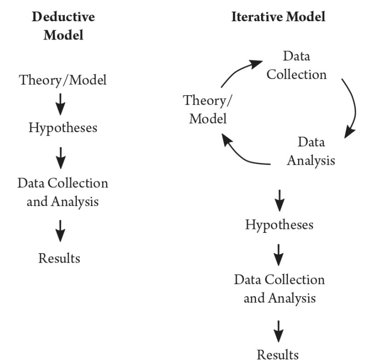

# O Texto como um Dado

````{margin}
```{admonition} Citação
:class: note
""Os pesquisadores podem aprender muito sobre o comportamento humano a partir de textos, mas, para isso, é necessário um engajamento com o contexto em que esses textos são produzidos. Uma compreensão profunda do contexto das ciências sociais permitirá que os pesquisadores façam perguntas mais importantes e impactantes, garantam que as medidas extraídas sejam válidas e estejam mais atentos às implicações práticas e éticas de seu trabalho." ({cite}`grimmer2022text`, p. 25, Tradução nossa).
```
````

Nos últimos anos, a explosão de dados digitais e o avanço das capacidades computacionais transformaram a análise de texto em uma ferramenta poderosa para diferentes áreas — da ciência política às humanidades digitais e à indústria. No curso, focaremos em aplicações na ciência política e, mais especificamente, na nossa aplicação para publicações de políticos brasileiros na rede social X/Twitter. No entanto, cresce cada vez mais as aplicações nas humanidades e ciências sociais ([Exemplo](https://aclanthology.org/volumes/2024.nlp4dh-1/)). 


Textos são registros riquíssimos da atividade humana: é por meio da linguagem que se expressam políticas públicas, manifestações culturais, debates eleitorais e sentimentos. Ainda assim, até pouco tempo atrás, a análise sistemática de grandes volumes de texto era restrita ou inviável. Com o avanço dos métodos de **Aprendizado de Máquina** e técnicas de **Processamento de Linguagem Natural (PLN)**, passou a ser possível transformar textos em dados estruturados e analisá-los para fazer descrever e fazer inferências sobre o comportamento humano. No entanto, ainda há uma escassez de bancos de dados de textos com classificação e supervisão humana para a utilização no aprendizado de máquina, especialmente na Língua Portuguesa. Por isso, é necessário que mais pesquisadores tenham domínio das técnicas de aprendizado supervisionado (e não supervisionado). E também entendam que essas técnicas não substituem a análise atenciosa e dedicada do pesquisador, mas as amplificam, gerando oportunidades de pesquisa e descrição do comportamento humana de forma mais ampla.

---

## 📌 De onde vem esse debate?

O livro *Text as Data* (Grimmer, Roberts e Stewart, 2022) propõe um framework específico para integrar métodos de PLN e machine learning ao trabalho de pesquisa social, com foco em:

- **Descoberta**: identificar padrões, categorias ou temas em grandes volumes de texto.
- **Mensuração**: quantificar a presença de conceitos em textos.
- **Predição**: prever características ou resultados com base em dados textuais.
- **Inferência causal**: estimar efeitos de intervenções ou mudanças usando textos como variáveis.

> ✳️ Diferentemente da ciência da computação, o foco na pesquisa social é menos sobre otimizar modelos e mais sobre produzir inferências substantivas e teoricamente orientadas.


---

## 📚 Texto como dado: um novo paradigma para as Ciências Sociais

Antes, a abordagem padrão em ciências sociais era **dedutiva**: formular uma teoria, derivar hipóteses e então coletar dados para testá-las. O trabalho com grandes coleções de texto, porém, revela a importância de abordagens **indutivas e iterativas**, em que as perguntas de pesquisa podem emergir a partir da análise dos próprios dados.

> Exemplos:
> - Analisar postagens de políticos no Twitter para descobrir temas emergentes.
> - Mapear padrões de censura em redes sociais na China.
> - Medir o grau de negatividade em campanhas eleitorais.

<figure>
  
  <figcaption>Figura 1: Modelos Dedutivos e Interativos. 
  Fonte: Grimmer et al. (p.41)</figcaption>
</figure>


---

## 📝 Seis princípios fundamentais da análise de texto em ciências sociais

Segundo Grimmer et al. (2022), para aplicar PLN e machine learning a textos de forma válida, é essencial respeitar alguns princípios:

1. **Teoria e conhecimento substantivo são essenciais**: métodos computacionais organizam textos, mas cabe à teoria guiar a interpretação.
2. **Métodos computacionais não substituem humanos — eles os ampliam**.
3. **A construção e teste de teorias deve ser iterativa e acumulativa**.
4. **Os métodos de texto sintetizam generalizações a partir da linguagem**.
5. **Não existe método único ideal — a escolha depende da tarefa**.
6. **Validação é indispensável e depende da teoria e do objetivo da pesquisa**.

---

## 📊 Tarefas principais no uso de textos como dados

A proposta do livro é organizar a pesquisa baseada em texto não pelos algoritmos, mas pelas **tarefas sociais** que se quer realizar:

- **Representação**: transformar texto em dados (ex.: matrizes documento-termo, embeddings).
- **Descoberta**: encontrar padrões ou categorias (ex.: topic models, clustering).
- **Mensuração**: quantificar conceitos previamente definidos.
- **Predição**: prever variáveis de interesse a partir do texto.
- **Inferência causal**: estimar o efeito de intervenções ou eventos usando textos.

---

## 💡 Exemplo didático: Catalinac (2016)

Estudo clássico que ilustra o ciclo de descoberta → mensuração → inferência:
- **Problema**: por que políticos japoneses começaram a discutir mais segurança nacional após 1994?
- **Dados**: manifestos de campanha de todos os candidatos ao parlamento.
- **Método**: Latent Dirichlet Allocation (LDA) para identificar temas.
- **Validação**: leitura dos tópicos e comparação com fatos conhecidos.
- **Inferência**: estimativa do efeito da reforma eleitoral na mudança de agenda.

---

## 🚀 Conclusão

Trabalhar com **text as data** exige:
- Combinar métodos computacionais e teoria social.
- Respeitar a lógica iterativa de descoberta e refinamento conceitual.
- Validação constante, adequada aos objetivos substantivos e não apenas métricas padrão de machine learning.
- Entender que não existe organização “correta” dos textos — e sim representações mais ou menos úteis para determinadas perguntas.

---

## 📖 Referência

Grimmer, J., Roberts, M. E., & Stewart, B. M. (2022). *Text as Data: A New Framework for Machine Learning and the Social Sciences*. Princeton University Press.
