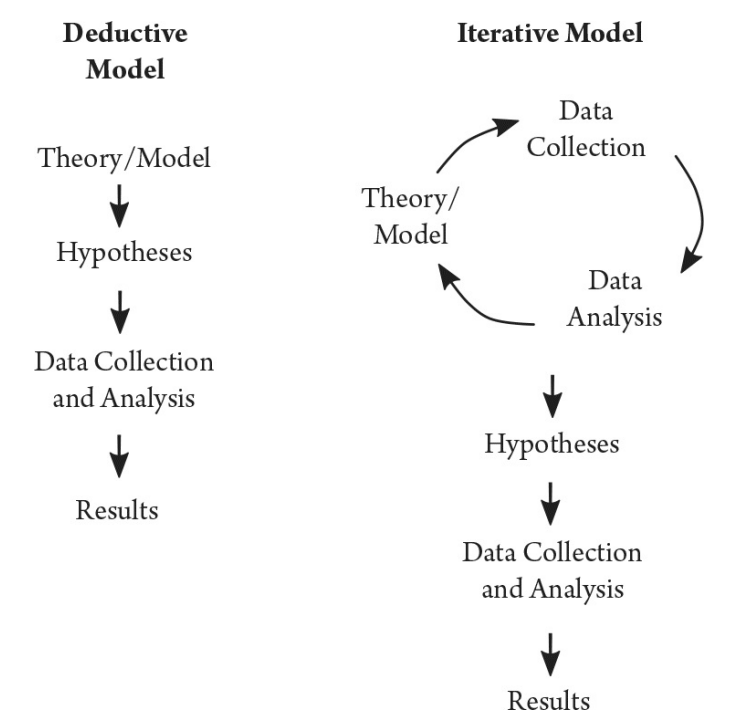

# Visão Geral do Curso

Este documento apresenta uma visão geral do curso, destacando seus principais objetivos, estrutura, público-alvo e benefícios. O curso foi desenvolvido para proporcionar uma experiência de aprendizado completa e prática, abordando tópicos relevantes e atuais.

---

## Objetivos do Curso

- Capacitar os participantes com conhecimentos teóricos e práticos.
- Desenvolver habilidades específicas relacionadas ao tema do curso.
- Promover a aplicação prática dos conceitos aprendidos.
- Preparar os alunos para desafios reais no mercado de trabalho.

---
<figure>
  
  <figcaption>Figura 1: Modelos Dedutivos e Interativos. 
  Fonte: Grimmer et al. (p.41)</figcaption>
</figure>
## Estrutura do Curso

O curso está organizado em módulos, cada um cobrindo um conjunto específico de tópicos. Abaixo está uma visão geral da estrutura:

### **Módulo 1: Introdução**
- Apresentação do tema
- Contextualização e importância

### **Módulo 2: Fundamentos**
- Conceitos básicos
- Ferramentas e metodologias

### **Módulo 3: Aplicações Práticas**
- Estudos de caso
- Projetos práticos

### **Módulo 4: Avançado**
- Tópicos avançados
- Tendências e inovações

### **Módulo 5: Encerramento**
- Revisão dos conteúdos
- Avaliação final
- Certificação

---

## Público-Alvo

Este curso é destinado a:

- **Profissionais** que desejam aprimorar suas habilidades.
- **Estudantes** interessados em adquirir novos conhecimentos.
- **Pessoas** que buscam uma transição de carreira.
- **Entusiastas** do tema que desejam aprofundar seus estudos.

---

## Benefícios do Curso

- Certificação ao final do curso.
- Acesso a materiais exclusivos e atualizados.
- Networking com outros participantes e profissionais da área.
- Acompanhamento de especialistas durante todo o processo de aprendizado.
- Preparação prática para o mercado de trabalho.

---

## Metodologia

O curso utiliza uma abordagem prática e interativa, combinando:

- Aulas teóricas
- Exercícios práticos
- Estudos de caso
- Projetos em grupo
- Avaliações periódicas

---

## Informações Adicionais

- **Duração do curso:** XX semanas  
- **Carga horária:** XX horas  
- **Formato:** Presencial / Online / Híbrido  
- **Pré-requisitos:** Nenhum / Conhecimentos básicos em [área relacionada]