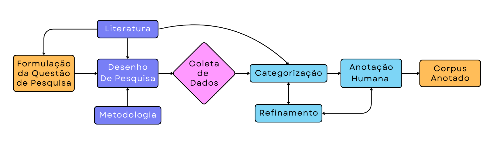

# Visão Geral do Curso

## Sobre a disciplina

**Metodologia:** A disciplina é  *Project-Based Learning*, ancorada no projeto *Mapping Political Elites COVID-19 Vaccine Tweets in Brazil*. O projeto visa anotar publicações no X (antigo *Twitter*) de políticos brasileiros sobre as vacinas de COVID-19 no período da pandemia. As categorias de anotação são: Se as publicações são relevantes com relação às vacinas de COVID-19 (**Relevância**), se possuem sentimentos negativos, positivos ou indeterminados (**Análise de Sentimento**); e se posicionam de forma contrária, favorável ou indeterminada com relação às vacinas (**Detecção de Posicionamento**). Mais detalhes sobre o processo de anotação, coleta, e os dados disponíveis estão no [Github](https://github.com/NUPRAM/CoViD-Pol) do NUPRAM (Núcleo de Políticas, Redes Sociais e Aprendizado de Máquina).

*Artigos Relacionados*:

* Barberia, L., Schmalz, P., Roman, N. T., Lombard, B., & Sousa, T. C. M. (2025). {cite}`barberia2025its` It's about What and How you say it: A Corpus with Stance and Sentiment Annotation for COVID-19 Vaccines Posts on X/Twitter by Brazilian Political Elites. In Proceedings of the 5th International Conference on Natural Language Processing for Digital Humanities (NLP4DH 2025).

* BARBERIA, Lorena Guadalupe; SCHMALZ, Pedro Henrique de Santana; ROMAN, Norton Trevisan. {cite}`barberia2023when` When Tweets Get Viral - A Deep Learning Approach for Stance Analysis of Covid-19 Vaccines Tweets by Brazilian Political Elites. In: SIMPÓSIO BRASILEIRO DE TECNOLOGIA DA INFORMAÇÃO E DA LINGUAGEM HUMANA (STIL), 14. , 2023, Belo Horizonte/MG. Anais [...]. Porto Alegre: Sociedade Brasileira de Computação, 2023 . p. 104-114. DOI: https://doi.org/10.5753/stil.2023.233961.


---

### O que é uma disciplina de Project-Based Learning?

Uma disciplina baseada em *Project-Based Learning* (PBL) é uma abordagem pedagógica centrada no aluno, que utiliza projetos como principal ferramenta de ensino e aprendizado. Suas principais características incluem:

- **Orientação por uma questão central ou problema:**  
  - O curso é estruturado em torno de uma questão ou problema, que guia o aprendizado e motiva os alunos a buscar soluções práticas e criativas para problemas de desenho de pesquisa, coleta de dados, e operacionalização de conceitos. Toda pesquisa deve se orientar por uma boa pergunta de pesquisa, ancorada tanto na literatura quanto na metodologia adequada para responder àquela pergunta.

- **Aprendizado ativo e prático:**  
  - Os alunos vão trabalhar em pares para responder os laboratórios. Essa abordagem colaborativa incentiva a troca de ideias e a discussão entre os pares, promovendo um ambiente de aprendizado ativo e participativo. A interação entre os alunos permite que diferentes perspectivas sejam exploradas, enriquecendo o processo de resolução de problemas e a compreensão dos conceitos abordados. A colaboração também estimula a autonomia, pois os alunos são encorajados a buscar soluções de forma independente, mas com o suporte mútuo de seus colegas e do coordenado de laboratórios. 

- **Foco no Desenho de Pesquisa e Aprendizado Supervisionado:**  
  *  Existem muitos métodos de aprendizado e modelos de aprendizado estatístico. Portanto, a disciplina focará em uma classe de modelos apenas: Modelos de aprendizado supervisionado, que utilizam córpus anotados por humanos. Isso nos permite avaliar de forma mais clara como os diversos modelos performam em tarefas diferentes, e guiar os alunos focando principalmente em como desenhar sua pesquisa para aplicar práticas de aprendizado supervisionado.

<figure>
  
  <figcaption>
    Figura 1: Processo de Construção de Um Corpus para aprendizado Supervisionado.  
    <br>Fonte: Autores (2025).
  </figcaption>
</figure>


---

## Objetivos do Curso

- **Principal objetivo:**  
  - Capacitar o aluno a refletir sobre as implicações do desenho de pesquisa em processamento de linguagem natural e em como utilizar os modelos mais clássicos (Regressão Logística, SVM, Random Forests, etc.).  

- **Outros objetivos:**  
  - Capacitar o aluno para leitura de códigos e aplicações em Python;  
  - Ensinar um protocolo para a aplicação de PLN para a Ciência Política;  
  - Introduzir o aluno ao Aprendizado de Máquina priorizando métodos supervisionados;  
  - Capacitar o aluno na criação de bancos de dados e corpus apropriados para os parâmetros de tarefas de aprendizado de máquina.


### O que o curso não é?

- Este não é um curso:  
  - Sobre Python e todas as suas funcionalidades e usos;  
  - Sobre Diferentes Abordagens e/ou Métodos de Aprendizado de Máquina (e.g. Aprendizado não supervisionado);  
  - Sobre a matemática/estatística utilizada nos modelos de aprendizado de máquina.  


### Motivação

- Os métodos de aprendizado supervisionado podem nos ajudar a classificar o debate nas redes sociais (e.g., Twitter) e outros documentos em forma de texto. Cada vez mais pesquisadores das humanidades digitais (*Digital Humanities*) aplicam os métodos de *Machine Learning* para classificar textos dos mais variados tipos ([Exemplos](https://aclanthology.org/volumes/2024.nlp4dh-1/)) e para os mais variados objetivos. As oportunidades de bancos de dados e pesquisas se ampliaram muito com o avanço dessas técnicas e a disponibilidade de dados.
- O monitoramento das redes se tornou ainda mais importante considerando que, devido às restrições da pandemia, muitos candidatos e políticos aumentaram o uso de mídias sociais para se comunicar com sua base (e.g., parlamentos fechados para deliberação e tramitação), e o eleitorado também teve engajamento nas redes. As redes sociais apresentam uma ótima oportunidade de estudar o discurso dos políticos sobre os mais diversos assuntos (e.g. COVID-19, Armas, etc.).  

### Funcionamento do curso

- **Modelo de aprendizado ativo.** - O curso funcionará com aulas em duas partes. Na primeira parte da aula (14h-16h e 19h-21h), os alunos terão uma aula expositiva sobre os principais assuntos da aula. Ao retorno do intervalo (16h15-18h e 21h15-23h) os alunos trabalharão em duplas nos laboratórios, com auxílio do coordenador de laboratórios. Será disponibilizado para eles um `jupyter notebook` (para ser trabalhado no Colab ou VScode) com textos explicativos, questões e exercícios.
```{warning}
Sobre o uso de LLMs: Existem diversas LLMs (e.g. ChatGPT, DeepSeek, LeChat, etc.), e lutar contra elas pode ser improdutivo e infrutífero. Pedimos aos alunos responsabilidade: O aprendizado e fixação também é de seu interesse, não proibimos o uso dessas ferramentas, mas insistimos que sempre tentem resolver primeiro sozinhos (e com seus pares) as listas de exercícios para que possam entender melhor o que estão fazendo. Cada aula do curso depende das aulas anteriores e do aprendizado contido nelas.
```
````

- **Etapas do curso:**  
  - Nivelamento de Python (aulas 1-5);  
  - Introdução ao Aprendizado de Máquina (aulas 6-11);  
  - Introdução ao Aprendizado Profundo e ao BERT (aulas 12-15).  

- **Avaliação:**  
  - Listas semanais (Graduação e Pós-graduação);  
  - Trabalho final (Pós-graduação).  


## O que é o Aprendizado Supervisionado?

Como dito acima, a disciplina focará apenas no aprendizado estatístico supervisionado. Os seguintes conceitos são essenciais para o aprendizado supervisionado:

<figure>
  
  <figcaption>Figura 1: Modelos Dedutivos e Interativos. 
  Fonte: Grimmer et al. (p.41)</figcaption>
</figure>


### 1. Target

Em toda tarefa de aprendizado supervisionado, temos um target ("alvo"). Em estatística usual, pensamos nesse como nosso "Y", ou variável dependente, ou variável explicada, que é o valor que desejamos prever ou classificar. O target é determinado com base em dados previamente anotados ou rotulados, que servem como referência para o treinamento do modelo. A relação entre o target e as variáveis preditoras, ou *features*, (Representadas por X) é modelada para encontrar padrões que possam ser generalizados para novos dados. Assim, o aprendizado supervisionado busca minimizar o erro entre as previsões do modelo e os valores reais do target, garantindo que o modelo seja capaz de realizar previsões precisas em dados não vistos.

````{margin}
```{note}
Target e Variável dependente são sinônimos. Assim como *features* e variáveis preditoras, ou variáveis explicativas, ou variáveis independentes. As principais diferenças são de jargões entre as áreas de Aprendizado de Máquina e a Estatística mais tradicional. No entanto, os conceitos são os mesmos. 
```
````

### 2. *Features*

*Features*, ou variáveis independentes, ou variáveis explicativas, são as variáveis utilizadas pelo pesquisador para tentar prever o valor do *target*, seja em uma tarefa de classificação ou de predição. No exemplo específico de uma tarefa em PLN (Processamento da Língua Natural), o nosso "x" é o texto (e.g. o conteúdo de um tweet), que vai ser processado de diversas formas para que o modelo de aprendizado possa trabalhar com ele. Outro exemplo é na classificação de pessoas que podem ser devedoras (aplicação comum de *ML* em bancos), que podem ter como variáveis explicativas dívidas anteriores, renda, idade, educação, etc.

### 3. *Banco de Treinamento*

Para que qualquer classificação automatizada seja possível, precisamos de um banco de treinamento. Esse é o banco que contém tanto nossas Targets (Y) quanto nossas *Features* (**X**). Veremos ao longo do curso que, para garantir que nossos resultados não são espúrios/pouco generalizáveis, precisamos dividir nosso banco de dados em dois ou três subconjuntos:

* **Banco de Validação**: Quando estamos fazendo validações cruzadas, como métodos de K-fold, validação simples, etc., precisamos dividir uma parcela dos dados para que estes não sejam "vistos" pelo modelo de aprendizado de máquina durante o treinamento. A intuição disto é que teremos uma prova de que o modelo conseguirá performar bem em dados não vistos. No entanto, como veremos nas aulas futuras, o banco de validação é visto durante o treinamento, por isso precisamos também de um banco de teste que com certeza não será visto no treinamento.

* **Banco de Teste**: Similar ao banco de validação, esse é um banco em que o modelo não será treinado em nenhum momento. Somente ao fim do treinamento, pegamos o modelo e colocamos ele para fazer suas predições no banco de teste, e avaliamos o resultado disto. Tudo isso será discutido novamente mais à frente. Mas todos esses passos garantem a reprodutibilidade dos nossos achados e aumentam nossa confiança de que estes resultados não variarão muito em outras aplicações do mesmo modelo no mesmo banco.

### 4. Predição vs. Classificação

No contexto de *Machine Learning*, predição e classificação são tarefas distintas, embora relacionadas. A predição refere-se à estimativa de valores contínuos, como prever o preço de uma casa ou a temperatura de um dia específico, com base em variáveis explicativas. Já a classificação envolve a categorização de dados em classes discretas, como determinar se um e-mail é spam ou não, ou identificar o sentimento de um texto como positivo, negativo ou neutro. Enquanto a predição utiliza algoritmos que minimizam o erro em variáveis contínuas (como regressão linear), a classificação foca em maximizar a precisão na atribuição de rótulos às categorias (como regressão logística ou árvores de decisão). Ambas as tarefas compartilham princípios fundamentais, mas diferem nos objetivos e nas métricas de avaliação utilizadas, como erro médio absoluto para predição e acurácia ou F1-score para classificação. No curso, focaremos em tarefas de classificação.

<figure>
  
  <figcaption>Figura 1: Modelos Dedutivos e Interativos. 
  Fonte: Grimmer et al. (p.41)</figcaption>
</figure>


